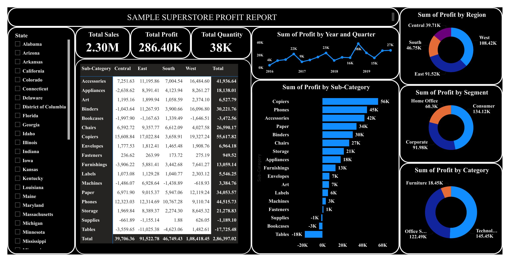

# 📊 Sample Superstore Profit Report

<div align="center">


**An interactive Power BI dashboard analyzing profit, sales, and quantity across the Sample Superstore dataset — broken down by region, segment, category, sub-category, state, and time.**

</div>

---

## 📸 Dashboard



---

## 📌 Table of Contents

- [Overview](#overview)
- [Key Metrics](#key-metrics)
- [Dashboard Views](#dashboard-views)
- [Insights](#insights)
- [Tech Stack](#tech-stack)
- [Data Model](#data-model)
- [Installation](#installation)
- [Usage](#usage)
- [Project Structure](#project-structure)


## Overview

This project analyzes the Sample Superstore dataset (US retail orders, 2016–2019) to identify where the business makes money and where it bleeds it. The report breaks profit down by region, customer segment, product category/sub-category, state, and quarter, so loss-making areas (specific sub-categories, specific regions) are immediately visible instead of buried in aggregate revenue numbers.

Built as a single-page interactive Power BI report with cross-filtering — clicking any region, segment, or category slices every other visual on the page.


## Key Metrics

| Metric | Value |
|:-------|:-----:|
| Total Sales | 2.30M |
| Total Profit | 286.40K |
| Total Quantity Sold | 38K |

---

## Dashboard Views

**Profit by Region**
| Region | Profit |
|:-------|-------:|
| West | 108.42K |
| East | 91.52K |
| South | 46.75K |
| Central | 39.71K |

**Profit by Segment**
| Segment | Profit |
|:--------|-------:|
| Consumer | 134.12K |
| Corporate | 91.98K |
| Home Office | 60.3K |

**Profit by Category**
| Category | Profit |
|:---------|-------:|
| Technology | 145.45K |
| Office Supplies | 122.49K |
| Furniture | 18.45K |

**Profit by Sub-Category (highlights)**
| Sub-Category | Profit |
|:-------------|-------:|
| Copiers | 55.6K |
| Phones | 44.5K |
| Accessories | 41.9K |
| Paper | 34.1K |
| Binders | 30.2K |
| Tables | -17.7K |
| Bookcases | -3.5K |
| Supplies | -1.2K |

**Profit by Year & Quarter (2016–2019)**
Shows a seasonal pattern — profit consistently peaks in Q4 of every year (holiday season demand), with a visible dip in Q1.

**Sub-Category × Region matrix** — full profit breakdown across all 17 sub-categories against all 4 regions, plus row/column totals.

---

## Insights

- **Tables, Bookcases, and Supplies are the only consistently loss-making sub-categories** — Tables alone lose ~17.7K, dragging down the entire Furniture category despite Chairs and Furnishings being profitable.
- **Furniture is the weakest category by far** (18.45K profit) compared to Technology (145.45K) and Office Supplies (122.49K), even though it likely isn't the lowest in sales volume — a classic high-discount, low-margin problem.
- **West and East regions drive most of the profit** (108.42K and 91.52K), while Central lags behind at 39.71K, partly due to negative Furniture and Appliances performance there.
- **Copiers and Phones are the highest-margin sub-categories**, making them strong candidates for upsell/bundling strategies.
- **Q4 is the strongest quarter every year** — inventory and marketing spend could be planned around this seasonality.

---

## Tech Stack

| Component | Technology |
|:----------|:-----------|
| Report & Visualization | Power BI Desktop |
| Data Modeling | Power Query (M) |
| Calculations | DAX Measures |
| Source Data | Sample Superstore dataset (CSV) |

---

## Data Model

Star-schema style model with a central **Orders** fact table (Sales, Profit, Quantity, Discount) joined to dimension fields for Region, State, Segment, Category, Sub-Category, and Order Date. Key DAX measures include Sum of Profit, Sum of Sales, Total Quantity, and time-intelligence breakdowns by Year/Quarter.

---

## Installation

### Prerequisites
- Power BI Desktop (free) — [download from Microsoft](https://powerbi.microsoft.com/desktop/)
- Windows 10/11

### Steps

```bash
# 1. Clone the repository
git clone https://github.com/rupin2207/Sample-Superstore-Profit-Report.git

# 2. Open the .pbix file
# Launch Power BI Desktop → File → Open → "PROFIT REPORT.pbix"
```

---

## Usage

1. Open `PROFIT REPORT.pbix` in Power BI Desktop
2. Use the Region, Segment, or Category visuals to cross-filter the entire report
3. Hover over any chart for exact values and tooltips
4. Use the Year/Quarter chart to drill down into seasonal trends
5. Refer to the Sub-Category × Region matrix for the full profit breakdown by state/region

---

## Project Structure

```
Sample-Superstore-Profit-Report/
│
├── PROFIT REPORT.pbix       # Power BI report file (open in Power BI Desktop)
├── PROFIT REPORT.pdf        # Static export of the dashboard
├── images/
│   └── dashboard.png        # Dashboard screenshot (used in this README)
└── README.md
```

---

<div align="center">

*Built to turn raw superstore transaction data into a clear, actionable profit story.*

</div>
